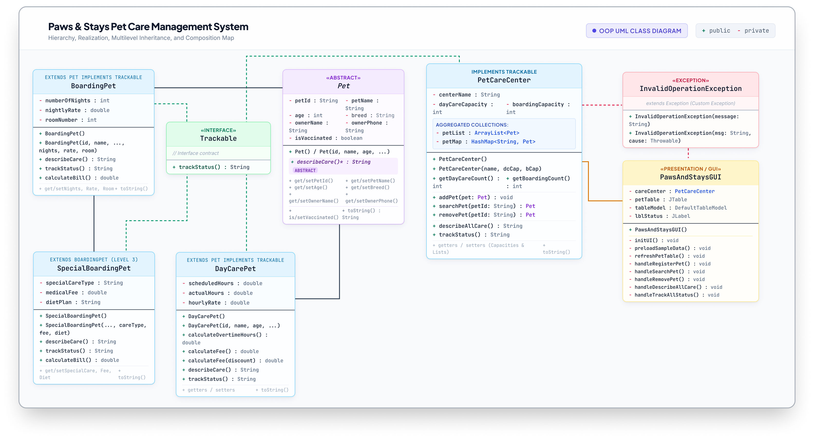
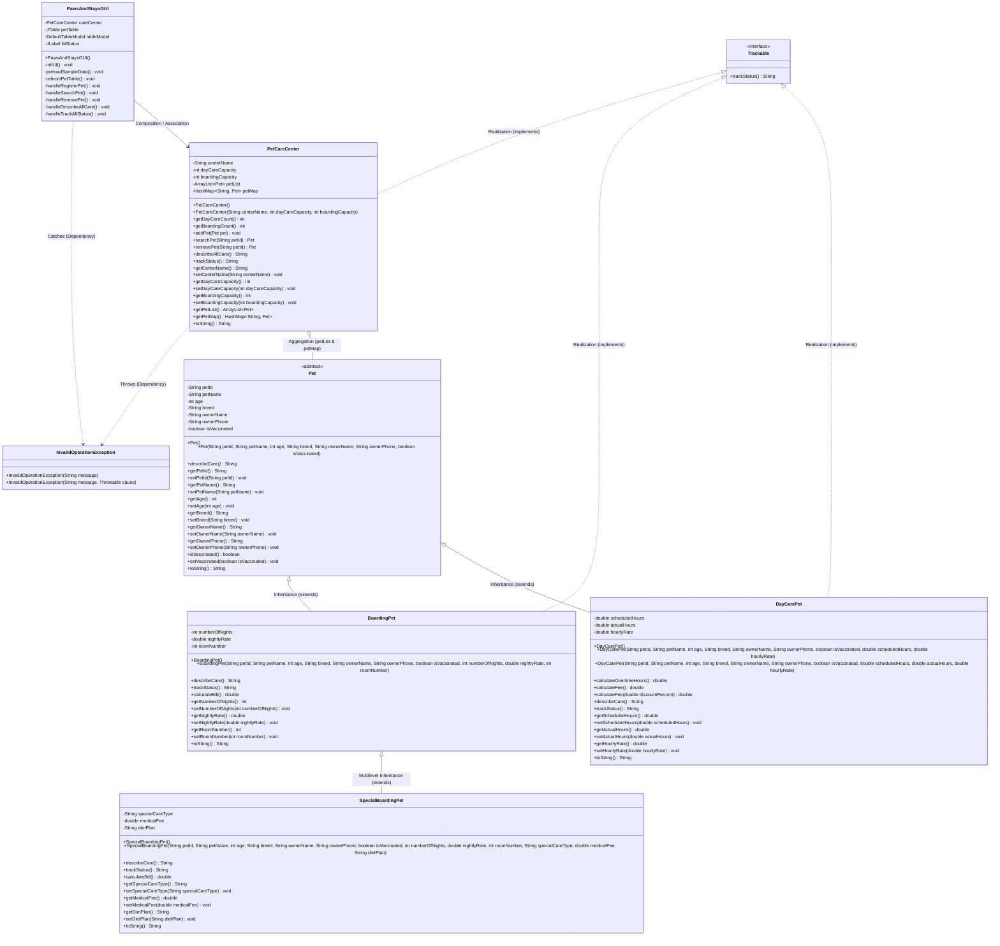

# Paws & Stays - Pet Day Care & Boarding Management System

A Java Swing desktop application and Object-Oriented Programming (OOP) project designed for managing pet admissions, day care activities, overnight boarding suites, specialized veterinary care, dynamic billing, and live facility tracking.


---

## 1. Project Overview & Scenario

**Paws & Stays** simulates an end-to-end pet resort management platform. The system handles registrations, health checks, room reservations, checkout billing, and live status monitoring for different categories of pets.

The system is architected around foundational OOP principles:
* **Encapsulation:** Private fields accessed strictly through public getters, setters, and constructors with robust domain validations (e.g., positive age in months, minimum daycare hours, positive rates, unique suite allocation).
* **Multilevel Inheritance:** A 3-level deep class hierarchy (`Pet` -> `BoardingPet` -> `SpecialBoardingPet`).
* **Method Chaining (`super.describeCare()`):** `SpecialBoardingPet` extends base boarding protocols by chaining `super.describeCare()` and adding specialized medical and dietary plans.
* **Abstraction (`describeCare()` vs `toString()`):** The abstract root class `Pet` declares `public abstract String describeCare()` to establish a domain-specific care protocol across all pet types, distinct from generic `toString()` debugging data.
* **Polymorphism:** 
  * *Dynamic Method Dispatch:* Processing `ArrayList<Pet>` in `PetCareCenter.describeAllCare()` and GUI cards where Java resolves the concrete subclass at runtime without `instanceof` casting.
  * *Interface Polymorphism:* Calling `trackStatus()` via the `Trackable` interface across both individual pets and overall facility management.
  * *Method Overloading:* Overloaded constructors and multi-tier fee calculation algorithms.
* **Custom Exception Handling:** Checked exception `InvalidOperationException` intercepts domain errors (capacity limits, duplicate IDs, occupied rooms) and safely alerts staff through dialogs.
* **Collections Framework:** `ArrayList<Pet>` for sequential roster tracking and `HashMap<String, Pet>` for O(1) instantaneous ID lookups.
* **Event-Driven GUI:** A clean Java Swing interface (`PawsAndStaysGUI`) featuring dynamic `CardLayout` forms, interactive `JTable` roster, real-time live telemetry tracking, and pet search/checkout operations.

---

## 2. System Architecture & UML Class Diagram

### UML Class Diagram Preview


### Native Mermaid Diagram


---

## 3. Class Hierarchy & OOP Implementation

| Class / Interface | Type | Role in System |
| :--- | :--- | :--- |
| **`Trackable`** | `interface` | Declares `String trackStatus()` contract implemented across both pets and center. |
| **`Pet`** | `abstract class` | Root parent (Level 1) defining shared pet attributes and abstract `describeCare()`. |
| **`DayCarePet`** | `class` | Level 2 child class managing short stays, actual vs scheduled hours, and hourly billing. |
| **`BoardingPet`** | `class` | Level 2 child class managing multi-night stays, suite numbers, and nightly billing. |
| **`SpecialBoardingPet`** | `class` | Level 3 grandchild class extending `BoardingPet` with medical care, diet plans, and fees. |
| **`PetCareCenter`** | `class` | Business logic manager implementing `Trackable`, maintaining `ArrayList` and `HashMap`. |
| **`InvalidOperationException`** | `class` | Custom checked exception for intercepting domain and operational errors. |
| **`PawsAndStaysGUI`** | `class` | Swing desktop GUI providing the staff dashboard, registration forms, and live tables. |

---

## 4. Project Directory Structure

```
├── .gitignore                     # Git configuration ignoring compiled bytecode
├── README.md                      # Primary GitHub repository documentation
├── overview.md                    # Project brief & scenario mapping
├── roadmap.md                     # Phased development history & task list
├── UML.md                         # Dedicated UML diagrams and architectural notes
├── DESIGN.md                      # UI/UX design specifications & component hierarchy
├── img/
│   └── uml.png                    # Rendered UML class diagram image
└── src/
    ├── Trackable.java             # Interface contract for tracking telemetry
    ├── Pet.java                   # Abstract base class
    ├── DayCarePet.java            # Day care model
    ├── BoardingPet.java           # Overnight boarding model
    ├── SpecialBoardingPet.java    # Specialized medical boarding model
    ├── InvalidOperationException.java # Custom checked domain exception
    ├── PetCareCenter.java         # Backend controller & collections manager
    ├── PawsAndStaysGUI.java       # Interactive Swing GUI application
    └── img/
        └── paw.png                # Application runtime icon asset
```

---

## 5. How to Compile and Run

### Prerequisites
* Java Development Kit (JDK 11 or higher recommended, tested on JDK 17).

### Compilation
From the project root directory, compile all Java source files into a dedicated `bin` directory:
```bash
javac -d bin src/*.java
```

### Execution
Run the GUI application with:
```bash
java -cp bin PawsAndStaysGUI
```

---

## 6. Group Project Contributors

* **Team Member 1:** [Name / Student ID] - Role & Core Contributions
* **Team Member 2:** [Name / Student ID] - Role & Core Contributions
* **Team Member 3:** [Name / Student ID] - Role & Core Contributions
* **Team Member 4:** [Name / Student ID] - Role & Core Contributions

---

## 7. Course & Academic Information
* **Course:** Object-Oriented Programming (CSE 3rd Semester)
* **Project Name:** Paws & Stays Pet Care Management System
* **Language:** Java (JDK 17) & Java Swing GUI
